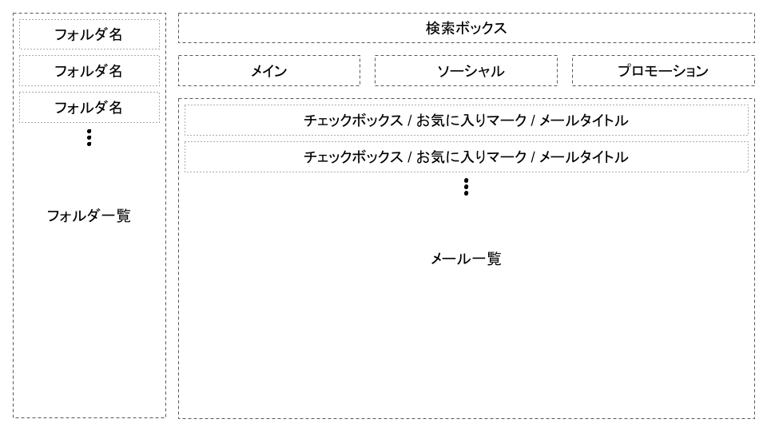

2022『フロントエンド・プログラミング』期末レポート (HTML / CSS)
===============================================================================

## 1. メールアプリのレイアウト作成 (15 点)

以下のデザインカンプを参考に、<b style="color: #EE6666;">Bootstrap を用いて</b> 枠線のみの仮組みページを作成してください。

ただし：

- HTML 内にべた書きで CSS を書かずに、ファイルとして分割する
- HTML のファイル名は `01_layout.html` とする
- CSS のファイル名は `01_layout.css` とする

## 2. メールアプリの色指定 (15 点)

なんらかのメールアプリを参考に、問 1 で作成したレイアウトに色指定をしてください。
(文字色，枠線色，背景色，etc ...)

ただし：

- HTML 内にべた書きで CSS を書かずに、ファイルとして分割する
- `<head>` タグ内にコメントで、参考にしたメールアプリの公式 HP を記載する
- HTML のファイル名は `02_colored.html` とする
- CSS のファイル名は `02_colored.css` とする

## 3. メールアプリへのアイコン配置 (15 点)

問 2 で作成した色指定済みのレイアウトに、ユーザーへの分かりやすさを考慮してアイコンを配置してください。

ただし：

- HTML 内にべた書きで CSS を書かずに、ファイルとして分割する
- アイコンは必要な分だけ [iconmonstr](https://iconmonstr.com) からダウンロードする
- アイコンは全て `assets` フォルダ内に格納する
- HTML のファイル名は `03_icon.html` とする
- CSS のファイル名は `03_icon.css` とする

## 4. オリジナリティの付与 (15 点)

問 3 までで作成したアイコン配置と色指定済みのレイアウトに、自分なりに工夫してさらにデザインを付け加えてください。
(ホバーエフェクト，アニメーション，JavaScript による振る舞いの追加，etc ...)

ただし：

- HTML 内にべた書きで CSS を書かずに、ファイルとして分割する
- HTML のファイル名は `index.html` とする
- CSS のファイル名は `index.css` とする
- `REPORT.md` というファイルに、デザインで工夫した点を箇条書きで記述する
